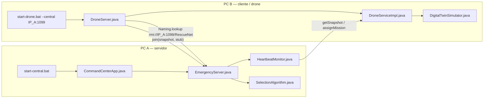
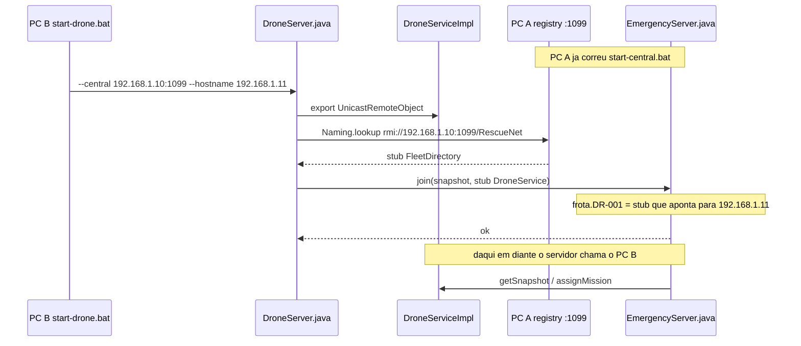
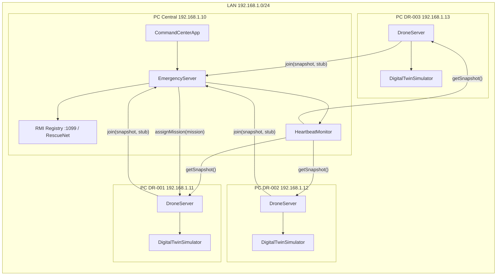
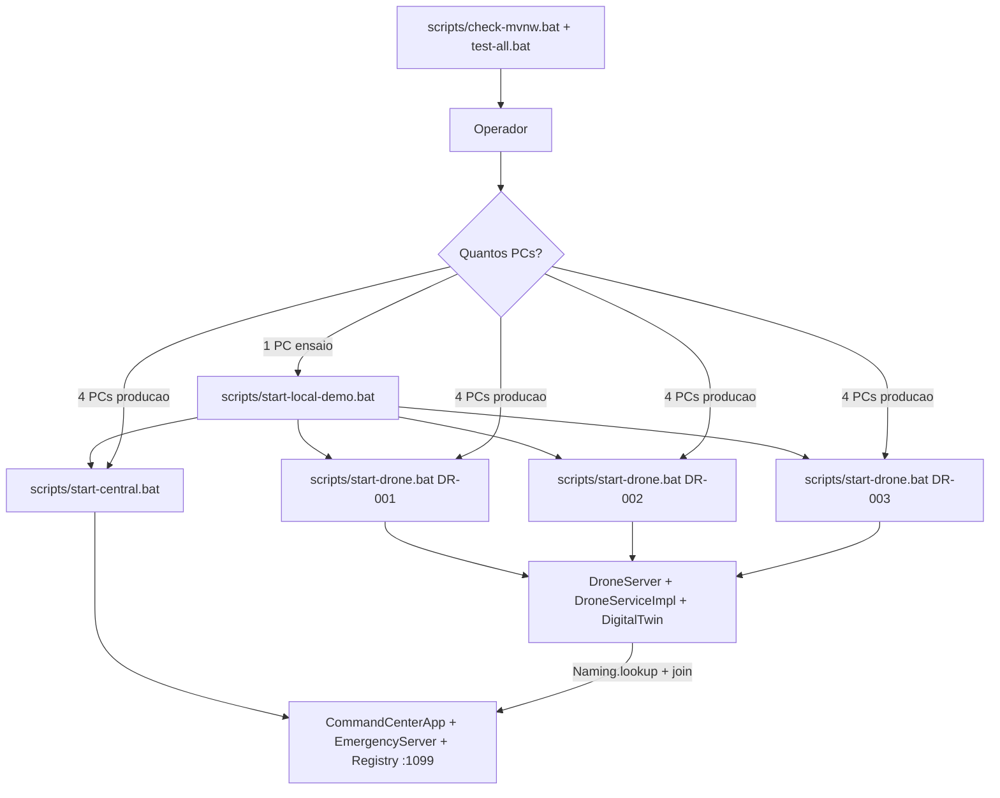
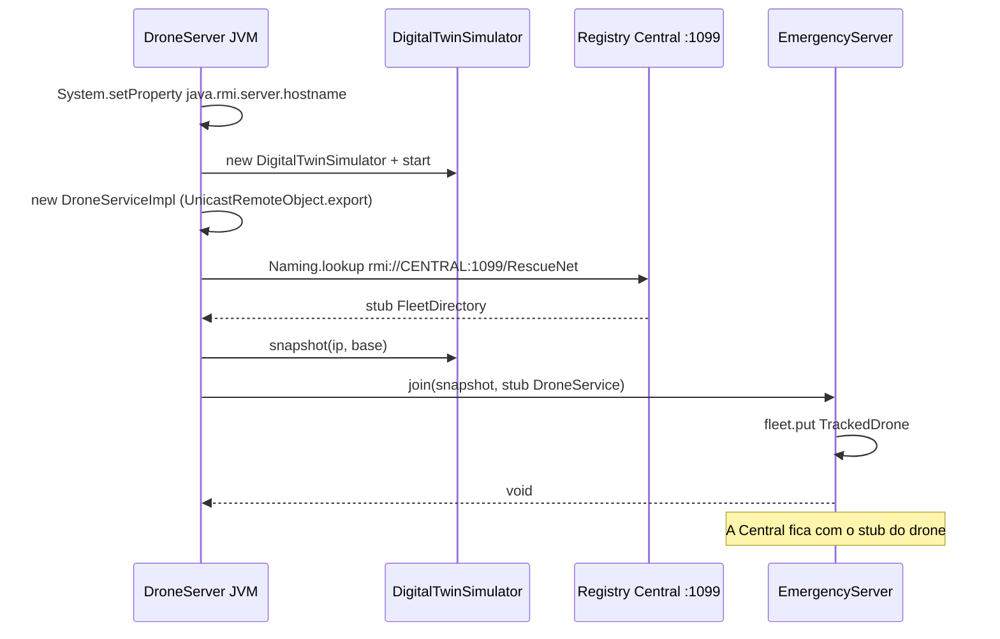
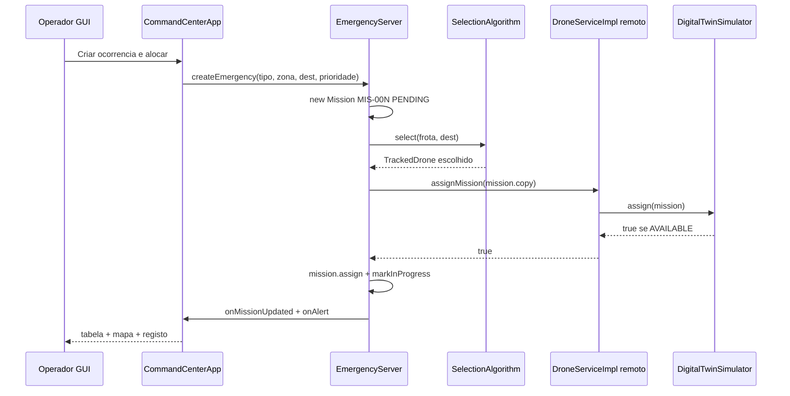
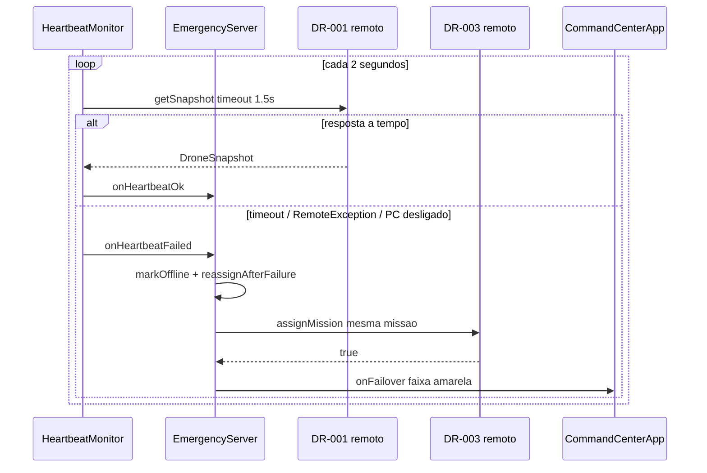
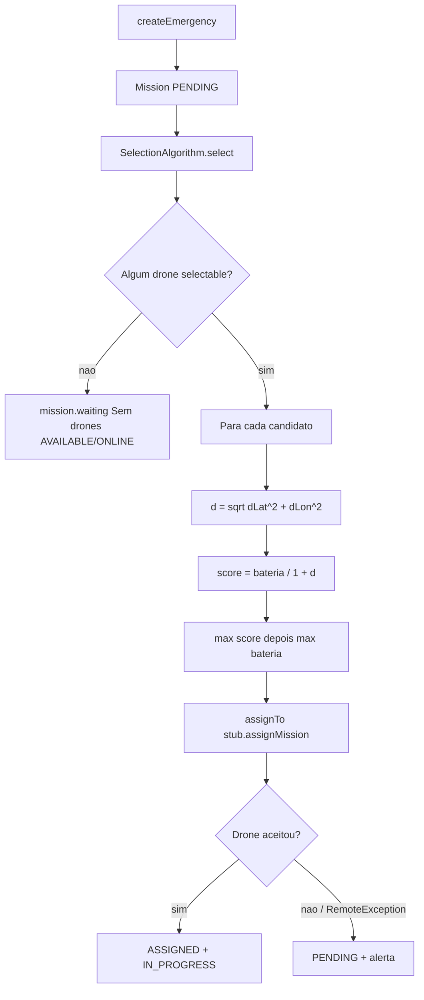
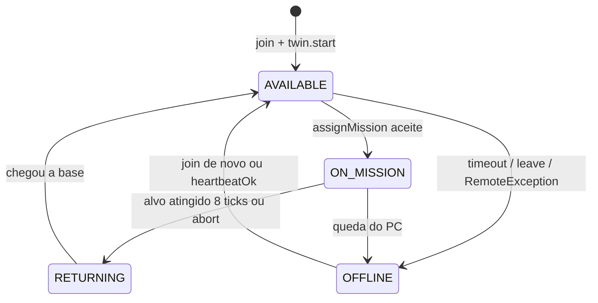
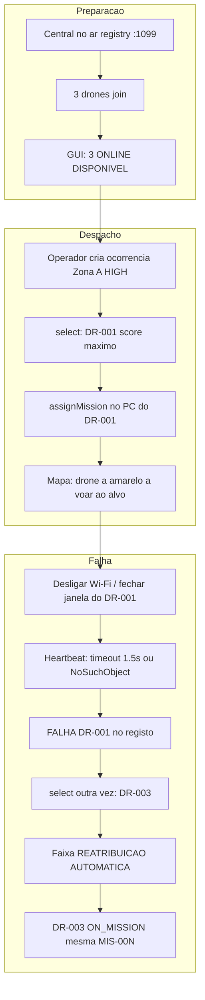

# RescueNet — Instruções de produção

Guia para apresentar e operar o sistema em LAN: como ligar PCs na mesma rede, que scripts sobem cada nó, que métodos RMI são invocados, como a distância euclidiana escolhe o drone, e o que mostrar ao júri.

> Quando um drone falha, a missão não pode falhar.

---

## 1. O que é apresentado

RescueNet é um sistema distribuído em **Java 26 + Java RMI**. Cada drone corre numa **JVM própria** (na demo de produção, num **PC próprio**). O Command Center:

1. expõe um registry RMI na porta **1099** com o nome `RescueNet`;
2. recebe o `join` de cada drone (o drone envia o próprio stub);
3. escolhe o melhor drone **ONLINE + AVAILABLE** por **bateria e proximidade euclidiana**;
4. faz heartbeat a cada **2 s** (timeout **1,5 s**);
5. se o nó em missão cair, **reatribui sozinho** ao próximo disponível.

| Papel | Processo | Classe `main` | Script |
|---|---|---|---|
| Central / Command Center | 1 JVM + GUI JavaFX | `rescuenet.gui.CommandCenterApp` | `scripts\start-central.bat` |
| Drone | 1 JVM por drone | `rescuenet.drone.DroneServer` | `scripts\start-drone.bat` |
| Demo local (1 PC) | 4 JVMs | os dois acima | `scripts\start-local-demo.bat` |

Módulos:

```
rescuenet.common    contrato RMI e DTOs serializáveis
rescuenet.drone     DroneServer + digital twin (bateria e movimento)
rescuenet.central   registry, selecção, heartbeat, reatribuição
rescuenet.gui       Command Center JavaFX
```

Índice: [ficheiros](#2-ficheiros-mais-importantes) · [ligar o outro PC ao servidor](#3-como-o-outro-pc-liga-ao-servidor) · [rede / firewall](#4-ligar-outro-computador-na-mesma-rede) · [scripts](#5-scripts-o-que-chamam-e-quando-usar) · [métodos RMI](#6-como-os-métodos-são-chamados) · [euclidiana](#7-distância-euclidiana-e-escolha-do-drone) · [guião](#9-guião-do-que-mostrar-em-produção)

---

## 2. Ficheiros mais importantes

Estes são os ficheiros a abrir no IDE durante a apresentação. O resto (CSS, testes, `pom.xml`) só se o júri perguntar.

### 2.1 Árvore (o que importa)

```
rescue-net/
├── instruction.md                          este guia
├── mvnw.cmd                                Maven Wrapper (não instalar Maven)
├── scripts/
│   ├── start-central.bat                   SOBE O SERVIDOR (PC Central)
│   ├── start-drone.bat                     LIGA AO SERVIDOR (outro PC)
│   └── start-local-demo.bat                ensaio num único PC
└── src/main/java/rescuenet/
    ├── common/
    │   ├── FleetDirectory.java             contrato: drone → Central (join/leave)
    │   ├── DroneService.java               contrato: Central → drone
    │   ├── Coordinates.java                distância euclidiana + stepTowards
    │   └── NetworkAddresses.java           rmi://IP:porta/RescueNet
    ├── central/
    │   ├── EmergencyServer.java            o servidor (registry + dispatch + failover)
    │   ├── SelectionAlgorithm.java         score = bateria / (1 + d)
    │   ├── HeartbeatMonitor.java           getSnapshot a cada 2 s
    │   └── TrackedDrone.java               stub RMI + ONLINE/AVAILABLE
    ├── drone/
    │   ├── DroneServer.java                lookup + join a partir do outro PC
    │   ├── DroneServiceImpl.java           objecto RMI exportado no PC drone
    │   └── DigitalTwinSimulator.java       voo, bateria, estados
    └── gui/
        └── CommandCenterApp.java           botão «Criar ocorrência» + faixa failover
```

### 2.2 O que abrir, e porquê

| Ficheiro | Papel na demo | Frase para o júri |
|---|---|---|
| `scripts\start-central.bat` | Arranca o **servidor** neste PC | «Este script sobe a GUI e o registry RMI na 1099.» |
| `scripts\start-drone.bat` | **Liga este PC** ao servidor remoto | «`--central IP:1099` é o endereço do outro computador.» |
| `drone\DroneServer.java` | `Naming.lookup` + `join` | «O outro PC não faz bind no registry; faz lookup e join.» |
| `common\FleetDirectory.java` | Nome `RescueNet`, `join` / `leave` | «É o único nome no registry. Bind remoto é recusado pelo RMI.» |
| `common\DroneService.java` | `getSnapshot`, `assignMission`, `abortMission` | «Depois do join, a Central chama o drone por este stub.» |
| `central\EmergencyServer.java` | Cria o registry, despacha, reatribui | «O servidor vive só no PC Central.» |
| `central\SelectionAlgorithm.java` | Escolha do drone | «Não é aleatório: bateria a dividir por 1 + distância.» |
| `common\Coordinates.java` | `euclidean` / `stepTowards` | «A distância é \(\sqrt{\Delta lat^2+\Delta lon^2}\).» |
| `central\HeartbeatMonitor.java` | Detecção de queda | «2 s entre sondas, 1,5 s de timeout — depois failover.» |
| `gui\CommandCenterApp.java` | O que o público vê | «O botão chama `createEmergency`; a faixa amarela é o `onFailover`.» |
| `drone\DigitalTwinSimulator.java` | O drone «a voar» | «Cada tick de 400 ms anda 0,0045° e gasta bateria.» |

### 2.3 Quem corre em que PC



Os contratos `FleetDirectory.java` e `DroneService.java` existem **nos dois PCs** (mesmo JAR). Sem o mesmo contrato, o RMI não desserializa o stub.

---

## 3. Como o outro PC liga ao servidor

Este é o fluxo que se demonstra quando um computador (drone) se liga ao Command Center que já está a correr noutro computador.

### 3.1 A ideia em uma frase

O PC drone **não cria** o servidor. Faz `Naming.lookup("rmi://<IP-DA-CENTRAL>:1099/RescueNet")` e depois `directory.join(snapshot, stub)`.

Isso acontece em `DroneServer.java`, disparado por `scripts\start-drone.bat`.

### 3.2 Passo a passo (dois PCs)

**No PC A (servidor / Central)**

1. Descobrir o IP deste PC:

```bat
ipconfig
```

Anotar o IPv4 da LAN, por exemplo `192.168.1.10`.

2. Compilar e subir o servidor:

```bat
cd D:\Programming\rescue-net
mvnw.cmd package
scripts\start-central.bat --port 1099
```

3. Confirmar no canto da GUI:

```
rmi://192.168.1.10:1099/RescueNet
```

Enquanto esta janela estiver aberta, o registry está a escutar na porta **1099**. Os outros PCs ligam-se a **este** endereço.

**No PC B (drone / outro computador)**

1. Mesmo projecto (clone ou pasta copiada) e mesmo JAR (`mvnw.cmd package` se ainda não compilou).
2. Descobrir o IP **deste** PC B:

```bat
ipconfig
```

Exemplo: `192.168.1.11`.

3. Testar que o PC B alcança o servidor:

```bat
ping 192.168.1.10
```

4. Ligar ao servidor — o argumento decisivo é `--central`:

```bat
scripts\start-drone.bat --id DR-001 --base Maputo --lat -25.9692 --lon 32.5732 --battery 90 --central 192.168.1.10:1099 --hostname 192.168.1.11
```

| Argumento | Valor | Significado |
|---|---|---|
| `--central` | `192.168.1.10:1099` | **IP e porta do PC A** (onde está o servidor) |
| `--hostname` | `192.168.1.11` | **IP deste PC B** (para a Central conseguir chamar de volta) |

`--central` = «onde está o servidor».  
`--hostname` = «qual é o meu IP, para o servidor me encontrar».

5. Consola do PC B, sucesso:

```
[DR-001] a ligar ao Command Center em rmi://192.168.1.10:1099/RescueNet (hostname RMI=192.168.1.11)
[DR-001] registado. Digital twin activo em Maputo.
```

6. GUI do PC A: linha `DR-001` **ONLINE / DISPONÍVEL**.

Repetir o passo 4 noutros PCs com `--id` / `--hostname` diferentes e o **mesmo** `--central 192.168.1.10:1099`.

### 3.3 O que o código faz no outro PC

`scripts\start-drone.bat` apenas lança:

```bat
java -cp "target\rescue-net-1.0.0.jar" rescuenet.drone.DroneServer %*
```

`DroneServer.main` (no PC B):

```java
// 1. O stub deste drone anuncia o IP DESTE PC, não o da Central
System.setProperty("java.rmi.server.hostname", hostname);

// 2. URL do servidor no OUTRO computador
String directoryUrl = NetworkAddresses.rmiUrl(centralHost, centralPort, "RescueNet");
// → "rmi://192.168.1.10:1099/RescueNet"

// 3. Exporta DroneService nesta JVM
DroneServiceImpl drone = new DroneServiceImpl(...);

// 4. Liga ao registry remoto (até 30 s de retry)
FleetDirectory directory = (FleetDirectory) Naming.lookup(directoryUrl);

// 5. Entrega o stub à Central — a partir daqui o servidor chama este PC
directory.join(drone.getSnapshot(), drone);
```



### 3.4 Erros clássicos ao ligar o outro PC

| O que se vê no PC B | Causa | Correcção |
|---|---|---|
| `registry da Central ainda não disponível` (30 s e aborta) | PC A ainda não subiu, IP errado, ou firewall na 1099 | Central primeiro; `ping`; `--central` = IP do **servidor** |
| `ConnectException` / `UnknownHost` | `--central` com IP velho ou typo | Novo `ipconfig` no PC A |
| Join aparece e some (OFFLINE) | `--hostname 127.0.0.1` — a Central chama-se a si | `--hostname` = IP **deste** PC B |
| Nada na frota | Drone a apontar para outro porto/host | URL no cabeçalho da GUI tem de bater certo com `--central` |
| `already bound` / porto ocupado no PC A | Já há um `start-central` aberto | Fechar a janela antiga |

Nunca usar `--central 127.0.0.1:1099` no PC B: `127.0.0.1` é o **próprio** PC B, não o servidor.

### 3.5 Terceiro e quarto PC

O comando é o mesmo; só mudam `--id`, base, coordenadas, bateria e `--hostname`:

```bat
scripts\start-drone.bat --id DR-002 --base Matola --lat -25.9622 --lon 32.4589 --battery 76 --central 192.168.1.10:1099 --hostname 192.168.1.12
scripts\start-drone.bat --id DR-003 --base Marracuene --lat -25.7369 --lon 32.6744 --battery 95 --central 192.168.1.10:1099 --hostname 192.168.1.13
```

`--central` permanece `192.168.1.10:1099` em todos os clientes.

---

## 4. Ligar outro computador na mesma rede

### 4.1 Pré-requisitos de rede

Todos os PCs têm de:

- estar na **mesma LAN** (mesmo router / mesmo prefixo, ex. `192.168.1.x`);
- conseguir **fazer ping** uns aos outros;
- ter **JDK 26** e o projecto compilado (`target\rescue-net-1.0.0.jar` + `target\lib`);
- ter a porta **TCP 1099** aberta no PC da Central (firewall do Windows);
- usar `--hostname` com o **IPv4 visível na LAN**, nunca `127.0.0.1` na demo multi-PC.

O RMI Registry **só aceita `bind`/`rebind` a partir do próprio host**. Por isso o drone **não se regista no registry remoto**. Exporta o `DroneService` na sua JVM e chama `FleetDirectory.join(snapshot, stub)` no Central.

```
Errado (não funciona entre PCs):  drone faz Naming.rebind no registry da Central
Certo:                           drone exporta stub local → join() no Central
```

### 4.2 Descobrir o IP de cada PC (Windows)

Em **todos** os PCs, no `cmd`:

```bat
ipconfig
```

Usar o IPv4 da placa Wi-Fi ou Ethernet (ex. `192.168.1.11`). Ignorar `127.0.0.1`, `172.x` de Docker/WSL e adaptadores virtuais, salvo se for mesmo essa a interface da LAN da demo.

Teste de conectividade a partir de um drone:

```bat
ping 192.168.1.10
```

Se o ping falhar, o RMI também falha. Resolver rede antes de subir processos.

### 4.3 Firewall (PC Central)

A Central cria o registry em **todas as interfaces** na porta **1099**. No PC da Central, permitir Java / porta 1099:

```bat
netsh advfirewall firewall add rule name="RescueNet RMI 1099" dir=in action=allow protocol=TCP localport=1099
```

Os drones também exportam objectos RMI (porta anónima). Se o Central conseguir `join` mas o heartbeat falhar com timeout, o firewall do **PC do drone** está a bloquear o regresso da chamada. Nesse caso permitir Java em rede privada:

```bat
netsh advfirewall firewall add rule name="RescueNet Java" dir=in action=allow program="%JAVA_HOME%\bin\java.exe" enable=yes
```

### 4.4 Porquê `--hostname` é obrigatório na LAN

`java.rmi.server.hostname` é o endereço que o **stub serializa**. Sem isto, o stub do drone aponta para `localhost`. A Central guarda esse stub e, ao chamar `getSnapshot()` / `assignMission()`, tenta falar consigo mesma — o drone nunca é alcançado.

| Máquina | `--hostname` correcto | `--hostname` errado |
|---|---|---|
| Central | IP LAN do PC Central (ou omitir: `NetworkAddresses.localHostName()`) | `127.0.0.1` se os drones estão noutro PC |
| Drone | IP LAN **deste** PC drone | `127.0.0.1` ou o IP da Central |

### 4.5 Arranque em 4 PCs (guião de produção)

IPs de exemplo do enunciado. **Substituir pelos IPs reais do `ipconfig`.**

| Papel | IP exemplo | Script e argumentos |
|---|---|---|
| Central | `192.168.1.10` | `scripts\start-central.bat --port 1099` |
| DR-001 Maputo | `192.168.1.11` | `scripts\start-drone.bat --id DR-001 --base Maputo --lat -25.9692 --lon 32.5732 --battery 90 --central 192.168.1.10:1099 --hostname 192.168.1.11` |
| DR-002 Matola | `192.168.1.12` | `scripts\start-drone.bat --id DR-002 --base Matola --lat -25.9622 --lon 32.4589 --battery 76 --central 192.168.1.10:1099 --hostname 192.168.1.12` |
| DR-003 Marracuene | `192.168.1.13` | `scripts\start-drone.bat --id DR-003 --base Marracuene --lat -25.7369 --lon 32.6744 --battery 95 --central 192.168.1.10:1099 --hostname 192.168.1.13` |

Ordem:

1. Compilar em cada PC (`mvnw.cmd package`) ou copiar `target\` já compilado.
2. **Primeiro a Central.** Confirmar no cabeçalho da GUI: `rmi://192.168.1.10:1099/RescueNet`.
3. Depois cada drone. Na consola do drone deve aparecer `registado. Digital twin activo`.
4. Na tabela da frota: três linhas **ONLINE / DISPONÍVEL**.

Se o drone imprimir `registry da Central ainda não disponível`, está a tentar `Naming.lookup` e a Central ainda não está no ar (repete até 30 s).

### 4.6 Demo local (ensaio num único PC)

```bat
scripts\start-local-demo.bat
```

Sobe Central + 3 drones com `--central 127.0.0.1:1099 --hostname 127.0.0.1`. Útil para ensaiar o guião; **não substitui** a demo de 4 PCs.

### 4.7 Diagrama — topologia de produção



---

## 5. Scripts: o que chamam e quando usar

Todos os `.bat` fazem `cd` para a raiz do repositório e usam `scripts\_mvn.bat` → `mvnw.cmd` se o JAR ainda não existir.

### 5.1 Scripts de produção (demo)

| Script | Classe Java | Argumentos | Quando usar |
|---|---|---|---|
| `scripts\start-central.bat` | `rescuenet.gui.CommandCenterApp` | `--port 1099` (omisso = 1099) | PC da Central. Sobe GUI + registry + heartbeat. |
| `scripts\start-drone.bat` | `rescuenet.drone.DroneServer` | `--id --lat --lon` obrigatórios; `--base --battery --central --hostname` opcionais | Um por PC drone. |
| `scripts\start-local-demo.bat` | os dois | fixos para localhost | Ensaio num PC. Abre 4 janelas. |

Cadeia do Central:

```
start-central.bat
  → java --module-path target\lib\javafx-* --add-modules javafx.controls,javafx.graphics,javafx.base
  → CommandCenterApp.main(--port)
  → EmergencyServer.start(port)
  → LocateRegistry.createRegistry(port)
  → registry.rebind("RescueNet", server)
  → HeartbeatMonitor.start()
  → Application.launch()  (JavaFX)
```

Cadeia do drone:

```
start-drone.bat --id DR-001 ... --central IP:1099 --hostname IP_DESTE_PC
  → java -cp target\rescue-net-1.0.0.jar rescuenet.drone.DroneServer
  → System.setProperty("java.rmi.server.hostname", hostname)
  → new DroneServiceImpl(...)   // exporta UnicastRemoteObject + arranca digital twin
  → Naming.lookup("rmi://IP:1099/RescueNet")
  → FleetDirectory.join(snapshot, this)
  → Thread.join() até fechar a janela
```

Argumentos do drone (`CliArgs`):

| Flag | Obrigatório | Default | Significado |
|---|---|---|---|
| `--id` | sim | — | Identificador único (`DR-001`) |
| `--lat` / `--lon` | sim | — | Coordenadas da **base** (e posição inicial) |
| `--base` | não | `Base` | Nome mostrado na GUI |
| `--battery` | não | `90` | Bateria inicial 5–100 % |
| `--central` | não | `127.0.0.1:1099` | Host:porta do registry |
| `--hostname` | não | 1.º IPv4 LAN | IP que o stub RMI anuncia |

### 5.2 Scripts de verificação (antes da apresentação)

| Script | Equivalente Maven | O que prova |
|---|---|---|
| `scripts\check-mvnw.bat` | `mvnw.cmd -v` | Wrapper + JDK 26 |
| `scripts\test-unit.bat` | `mvnw.cmd test` | Algoritmo, DTOs, digital twin (~20 testes) |
| `scripts\test-e2e.bat` | `mvnw.cmd verify -DskipUnitTests` | RMI real: join, despacho, failover |
| `scripts\test-all.bat` | `mvnw.cmd verify` | Unitários + e2e |
| `scripts\_mvn.bat` | `mvnw.cmd …` | Helper interno; não se apresenta |

Há equivalentes `.sh` para Git Bash / Linux.

### 5.3 Diagrama — cadeia de scripts



---

## 6. Como os métodos são chamados

Há **dois contratos RMI** e um conjunto de métodos **locais** (mesma JVM da Central / do drone).

### 6.1 Contrato `FleetDirectory` — o drone chama a Central

Interface: `rescuenet.common.FleetDirectory`  
Bind: `rmi://<ip-central>:1099/RescueNet`

| Método | Quem chama | Onde | Efeito |
|---|---|---|---|
| `join(DroneSnapshot, DroneService)` | `DroneServer.main` | após `Naming.lookup` | Central guarda stub + snapshot; alerta «Drone X ligado» |
| `leave(String droneId)` | shutdown hook do `DroneServer` | ao fechar a janela do drone | Central trata como falha (`onHeartbeatFailed(..., "leave")`) e tenta reatribuir |

O segundo argumento de `join` **é o stub RMI** do `DroneServiceImpl`. A partir daí a Central fala com o drone sem voltar ao registry.

### 6.2 Contrato `DroneService` — a Central chama o drone

Interface: `rescuenet.common.DroneService`  
Implementação exportada: `rescuenet.drone.DroneServiceImpl`

| Método | Quem chama | Quando | Efeito no drone |
|---|---|---|---|
| `getSnapshot()` | `HeartbeatMonitor.probe` | a cada 2 s | Devolve bateria, estado, posição, `missionId` |
| `assignMission(Mission)` | `EmergencyServer.assignTo` | despacho inicial ou failover | Digital twin passa a `ON_MISSION` se estava `AVAILABLE` |
| `abortMission(String)` | `EmergencyServer.recoverStaleAssignment` | drone offline voltou com missão já reatribuída | Aborta e regressa à base |
| `getId()` / `ping()` | disponíveis no contrato | diagnóstico | `ping()` devolve `true` |

`assignMission` devolve `false` se o drone já não está `AVAILABLE` (ocupado). A Central deixa a missão em `PENDING`.

### 6.3 Métodos locais da Central (mesma JVM da GUI)

| Método | Classe | Disparado por | Papel na demo |
|---|---|---|---|
| `EmergencyServer.start(port)` | `EmergencyServer` | `CommandCenterApp.main` | Cria registry, faz `rebind`, arranca heartbeat |
| `createEmergency(type, zona, dest, priority)` | `EmergencyServer` | botão **Criar ocorrência e alocar** | Cria `MIS-00N` e chama `dispatch` |
| `SelectionAlgorithm.select(frota, destino)` | `SelectionAlgorithm` | `dispatch` e `reassignAfterFailure` | Escolhe o melhor drone |
| `SelectionAlgorithm.score(drone, destino)` | `SelectionAlgorithm` | dentro de `select` | `bateria / (1 + distância)` |
| `onHeartbeatOk` / `onHeartbeatFailed` | `EmergencyServer` | `HeartbeatMonitor` | Actualiza frota; failover se caiu |
| `assignTo` | `EmergencyServer` | `dispatch` / reatribuição | Invocação RMI `assignMission` |
| `EmergencyListener.onFailover` | `CommandCenterApp.UiListener` | após reatribuição | Faixa amarela na GUI |

### 6.4 Sequência RMI — join



### 6.5 Sequência RMI — ocorrência e alocação



### 6.6 Sequência RMI — heartbeat e failover



Fechar a janela do drone dispara o shutdown hook (`leave`). Desligar o Wi-Fi / cabo **não** chama `leave`: o Central só vê **timeout** ou `RemoteException`. Os dois caminhos reatribuem.

---

## 7. Distância euclidiana e escolha do drone

### 7.1 Fórmula

Em `Coordinates.euclidean`:

\[
d = \sqrt{(lat_1 - lat_2)^2 + (lon_1 - lon_2)^2}
\]

Não é distância em quilómetros nem haversine. É distância no **plano lat/lon** — suficiente para comparar bases na Grande Maputo e para a demo.

O movimento do digital twin usa a mesma métrica em `stepTowards`: avança no máximo `0.0045` graus por tick (400 ms) na direcção do alvo.

### 7.2 Score de selecção

Em `SelectionAlgorithm.score`:

\[
score = \frac{bateria\%}{1 + d}
\]

`select` fica com o **máximo** score entre drones `selectable()` (`online && AVAILABLE`). Empate: maior bateria.

O `+ 1` evita divisão por zero se o drone já está no destino e dá peso à bateria mesmo em distâncias pequenas.

Filtros: **OFFLINE** e **ON_MISSION / RETURNING** nunca são escolhidos.

### 7.3 Exemplo numérico — ocorrência na Zona A

Destino Zona A: `(-25.9300, 32.5600)`

| Drone | Base | Posição | Bateria | \(d\) a Zona A | Score |
|---|---|---|---|---|---|
| DR-001 | Maputo | -25.9692, 32.5732 | 90 % | ≈ 0.0414 | **86.4** ← escolhido |
| DR-002 | Matola | -25.9622, 32.4589 | 76 % | ≈ 0.1061 | 68.7 |
| DR-003 | Marracuene | -25.7369, 32.6744 | 95 % | ≈ 0.2244 | 77.6 |

DR-003 tem mais bateria, mas está longe. DR-001 ganha. Se DR-001 cair a meio da missão, o algoritmo corre outra vez **sem** DR-001: DR-003 (77.6) ganha a DR-002 (68.7).

Isto é o que os testes e2e verificam (`DispatchFailoverE2E`).

### 7.4 Diagrama — decisão de alocação



### 7.5 Zonas pré-definidas na GUI

| Zona no combo | Coordenadas | Uso na apresentação |
|---|---|---|
| Zona A | -25.9300, 32.5600 | Caso principal (perto de Maputo) |
| Zona B | -25.8800, 32.6100 | Segunda ocorrência |
| Costa da Matola | -25.9550, 32.4300 | Favorece DR-002 |
| Norte de Marracuene | -25.7200, 32.6900 | Favorece DR-003 |

Latitude/longitude no formulário podem ser editadas à mão.

---

## 8. Ciclo de vida na produção

### 8.1 Estados do drone



Bateria por tick (400 ms), limitada a 5–100 %:

| Estado | Consumo / tick |
|---|---|
| `ON_MISSION` | 0.12 |
| `RETURNING` | 0.08 |
| `AVAILABLE` | 0.015 |
| `OFFLINE` | 0 |

Ao chegar ao destino, o twin **fica 8 ticks** (~3,2 s) e depois regressa à base. Quando `getSnapshot()` vem com `AVAILABLE` e sem `missionId`, a Central marca a missão `COMPLETED`.

### 8.2 Estados da missão

`PENDING` → `ASSIGNED` → `IN_PROGRESS` → `COMPLETED`  
Qualquer falha de alocação ou queda sem substituto volta a `PENDING` (`waiting`).

`isActive()` = `PENDING | ASSIGNED | IN_PROGRESS`. Só missões activas são reatribuídas.

### 8.3 Diagrama — missão completa até failover



---

## 9. Guião do que mostrar em produção

Ensaio no dia anterior: `scripts\test-all.bat` + `scripts\start-local-demo.bat`. No dia: 4 PCs.

Ficheiros a ter abertos no IDE (secção 2): `DroneServer.java` (lookup do outro PC), `FleetDirectory.java` + `DroneService.java` (contratos), `EmergencyServer.java`, `SelectionAlgorithm.java`, `Coordinates.java`, `HeartbeatMonitor.java`.

### Passo 0 — rede (1 min)

- `ipconfig` em cada PC; anotar IPs.
- `ping` da Central para cada drone e o inverso.
- Confirmar que os comandos `--central` e `--hostname` usam esses IPs.

### Passo 1 — Central

No PC Central:

```bat
mvnw.cmd package
scripts\start-central.bat --port 1099
```

Mostrar:

- título **RescueNet Command Center**;
- URL `rmi://<IP>:1099/RescueNet` no canto;
- frota vazia: «Nenhum drone registado».

### Passo 2 — drones (um por PC, nesta ordem)

```bat
scripts\start-drone.bat --id DR-001 --base Maputo --lat -25.9692 --lon 32.5732 --battery 90 --central 192.168.1.10:1099 --hostname 192.168.1.11
scripts\start-drone.bat --id DR-002 --base Matola --lat -25.9622 --lon 32.4589 --battery 76 --central 192.168.1.10:1099 --hostname 192.168.1.12
scripts\start-drone.bat --id DR-003 --base Marracuene --lat -25.7369 --lon 32.6744 --battery 95 --central 192.168.1.10:1099 --hostname 192.168.1.13
```

Mostrar na Central: três linhas ONLINE, baterias 90 / 76 / 95, mapa com Maputo / Matola / Marracuene.  
Na consola de cada drone: logs do digital twin (`bat=… estado=AVAILABLE`).

### Passo 3 — alocação (frase para o júri)

> «O Central não faz round-robin. Calcula distância euclidiana no plano lat/lon e o score bateria ÷ (1 + d). Para a Zona A o DR-001 (Maputo, 90 %) ganha ao DR-003 (95 % mas em Marracuene).»

Clicar **Criar ocorrência e alocar** (tipo Busca e salvamento, Zona A, HIGH).

Mostrar: `MIS-001 → DR-001`, estado `IN_PROGRESS`, drone a amarelo no mapa a avançar para o círculo da zona.

### Passo 4 — falha física (momento central)

Com a missão a correr no DR-001:

- **produção:** desligar Wi-Fi ou cabo do PC DR-001;
- **alternativa:** fechar a janela do processo.

Em ≤ ~3,5 s (intervalo 2 s + timeout 1,5 s):

- registo: `FALHA DR-001 (timeout 1500ms)` ou `NoSuchObjectException` / `leave`;
- faixa **REATRIBUIÇÃO AUTOMÁTICA**: `DR-001 caiu. MIS-001 foi reatribuída a DR-003`;
- DR-003 passa a EM MISSÃO; a missão **não** fica `FAILED`.

### Passo 5 — o que responder se perguntarem

| Pergunta | Resposta curta |
|---|---|
| Porque não `rebind` a partir do drone? | O registry RMI recusa bind remoto. O drone exporta o stub e faz `join`. |
| A distância é em km? | Não. Euclidiana em graus lat/lon, só para comparar candidatos. |
| O que acontece se não houver substituto? | Missão fica `PENDING` («Aguardando reatribuição»). |
| O drone morto volta? | Novo `join` ou heartbeatOk. Se a missão já foi dada a outro, a Central chama `abortMission`. |
| Heartbeat nos dois sentidos? | Não. Só a Central sonda `getSnapshot()`. O drone não faz ping à Central. |
| Várias missões? | A segunda ocorrência vai para o próximo AVAILABLE (ex. DR-002). |

---

## 10. Checklist de produção

**Antes de sair do laboratório**

- [ ] `scripts\check-mvnw.bat` — Maven 3.9.x + Java 26
- [ ] `scripts\test-all.bat` — unitários + e2e a verde
- [ ] `mvnw.cmd package` em cada PC (ou pasta `target\` copiada)
- [ ] IPs anotados; comandos dos drones já escritos num bloco de notas
- [ ] Firewall 1099 no PC Central; Java permitido nos PCs drone
- [ ] Mesma SSID / cabo no mesmo switch; sem VPN a mudar a rota

**No palco**

- [ ] Central primeiro; URL correcto no cabeçalho
- [ ] Três drones ONLINE antes de criar a ocorrência
- [ ] Zona A / HIGH — deve ir para DR-001
- [ ] Falha no PC do drone **em missão**, não noutro
- [ ] Esperar a faixa amarela antes de falar por cima

**Se falhar ao vivo**

| Sintoma | Causa típica | Correcção |
|---|---|---|
| Drone: «registry ainda não disponível» | Central em baixo, IP errado, firewall | Ping + URL + porta 1099 |
| Join ok, mas logo OFFLINE / timeout | `--hostname` = 127.0.0.1 ou firewall no drone | IP LAN no `--hostname`; regra Java inbound |
| Frota vazia na GUI | Drone a falar com outro host/porta | `--central` = IP **da Central** |
| Missão sem drone | Ninguém AVAILABLE | Esperar join; não criar ocorrência cedo demais |
| `ExportException` / porto ocupado | Já há um Central neste PC | Fechar a janela antiga ou mudar `--port` |

---

## 11. Mapa mental do código (para apontar no IDE)

Lista completa dos ficheiros: [secção 2](#2-ficheiros-mais-importantes). Encadeamento:

```
CommandCenterApp.main
    EmergencyServer.start
        LocateRegistry.createRegistry
        rebind RescueNet
        HeartbeatMonitor.scheduleAtFixedRate 2s
            drone.stub().getSnapshot()
            onHeartbeatOk / onHeartbeatFailed
                reassignAfterFailure
                    SelectionAlgorithm.select
                    assignTo → stub.assignMission

Botão GUI
    EmergencyServer.createEmergency
        dispatch
            SelectionAlgorithm.select
                Coordinates.euclidean
                score = battery / (1 + d)
            assignTo

DroneServer.main
    DroneServiceImpl  (export RMI)
    Naming.lookup
    FleetDirectory.join
    shutdown hook → leave
```

Constantes a citar:

| Constante | Valor | Ficheiro |
|---|---|---|
| Nome no registry | `RescueNet` | `FleetDirectory.BIND_NAME` |
| Porta default | `1099` | `CommandCenterApp` / `--port` |
| Intervalo heartbeat | 2000 ms | `HeartbeatMonitor.INTERVAL_MS` |
| Timeout heartbeat | 1500 ms | `HeartbeatMonitor.TIMEOUT_MS` |
| Tick do twin | 400 ms | `DigitalTwinSimulator.TICK_MS` |
| Passo de voo | 0.0045 ° | `DigitalTwinSimulator.CRUISE_STEP` |
| Espera no alvo | 8 ticks | `DigitalTwinSimulator.flyToObjective` |

---

## 12. Compilar e testar (referência rápida)

```bat
scripts\check-mvnw.bat
mvnw.cmd package
scripts\test-unit.bat
scripts\test-e2e.bat
```

`test-e2e` sobe um registry em `127.0.0.1` numa porta livre, faz `join` de dois drones, despacha Zona A (espera DR-001) e mata o processo para provar a reatribuição — o mesmo fluxo da demo, sem GUI.
